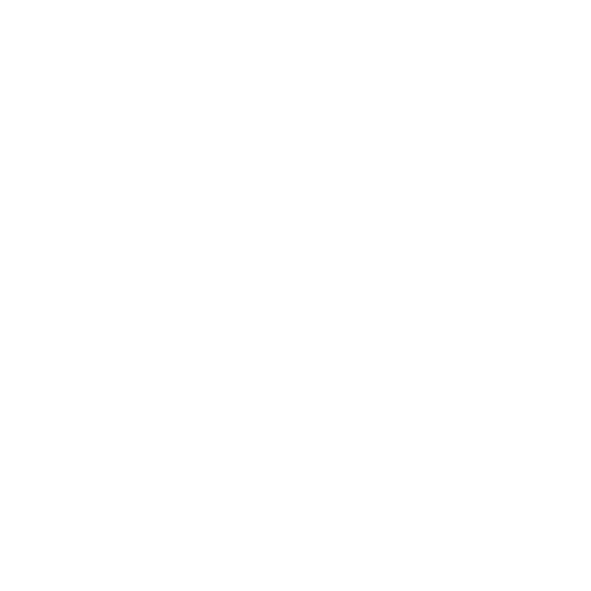
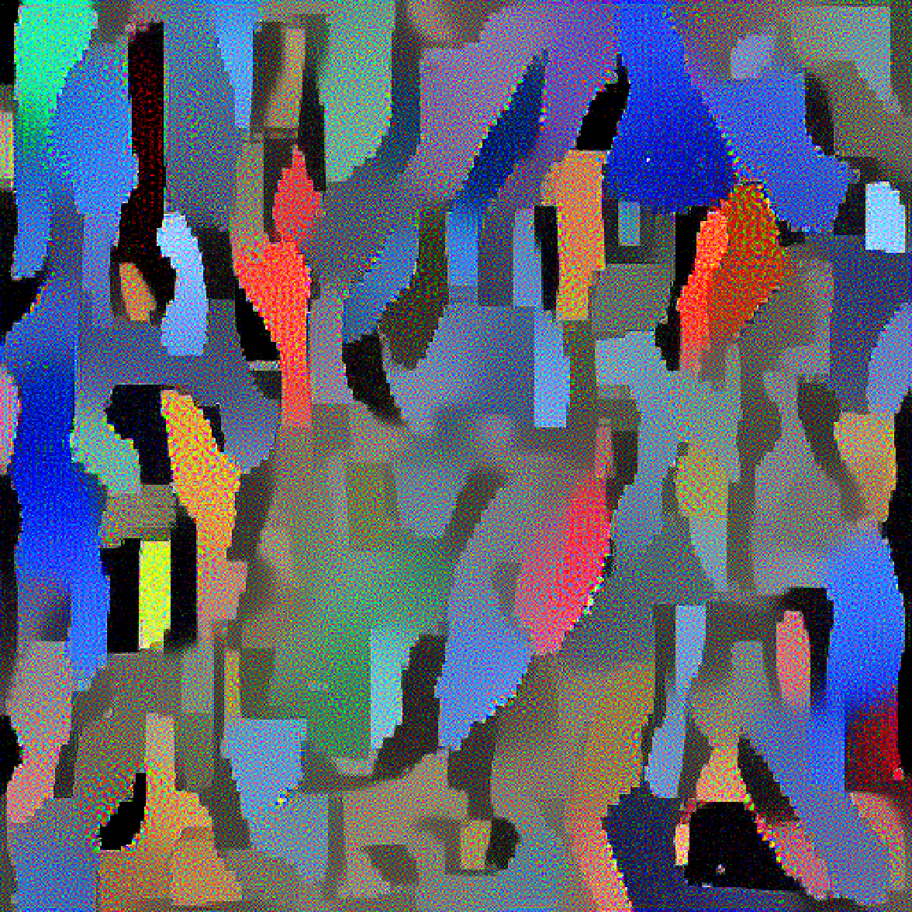

# Artistic Style Transfer
***This repository contains the code for Style Transfer from an Art to an Input Image using Keras and Tensorflow.***

# Requirements
1. **Tensorflow**
2. **Keras**
3. **Numpy**
4. **Scipy**

# Results

* Content Image                                 +                      Style Image            =       Style Transferred Image 

  

  

**Update:** ***Code tested on Windows 64-bit, Ubuntu 16.04 and Google Cloud Server Instance (Ubuntu 16.04, 7.50GB RAM)***

** It's quit slow **
